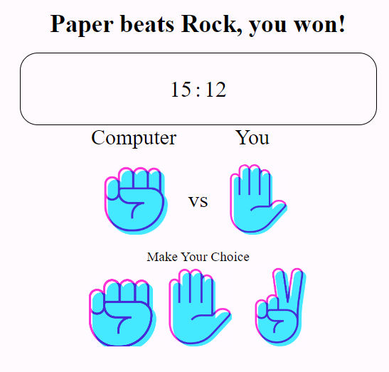

# JS_Rock-Paper-Scissors
A Rock Paper Scissors game versus a computer, created using Javascript, CSS, and HTML.

# Functionality
- Allows the user to participate in a paper scissors game against a computer
- Computer calculates its choice based on a randomizer function
- All in game decisions by the computer and the user are shown using the icons representing each choice

# Pictures of App

